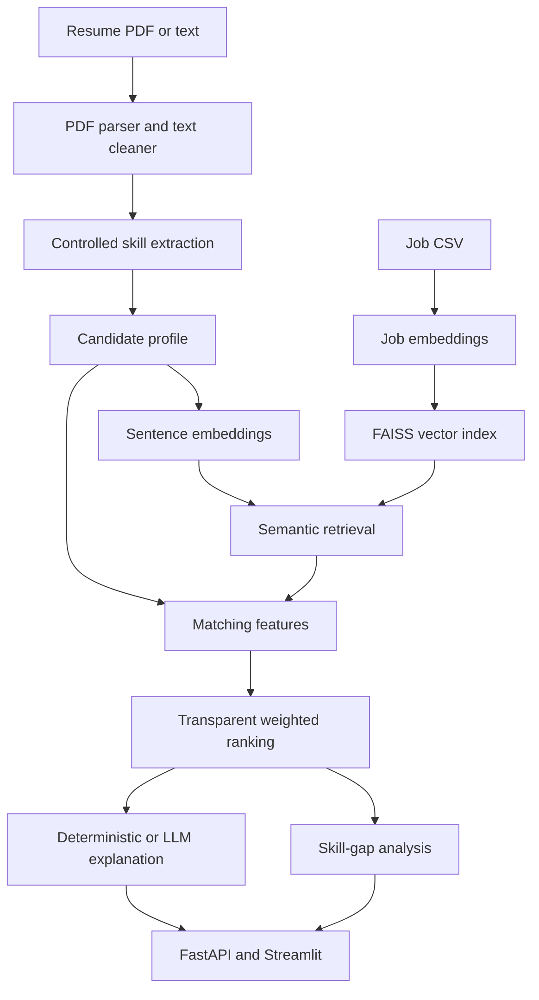

# Architecture

```mermaid
flowchart TD
    R[Resume PDF or text] --> P[PDF parser and text cleaner]
    P --> S[Controlled skill extraction]
    S --> C[Candidate profile]
    C --> E[Sentence embeddings]
    J[Job CSV] --> JE[Job embeddings]
    JE --> F[FAISS vector index]
    E --> V[Semantic retrieval]
    F --> V
    V --> X[Matching features]
    C --> X
    X --> Q[Transparent weighted ranking]
    Q --> G[Skill-gap analysis]
    Q --> L[Deterministic or LLM explanation]
    G --> U[FastAPI and Streamlit]
    L --> U
```

The LLM is downstream of retrieval and ranking. It receives structured match facts for explanation and never owns the ranking score.
